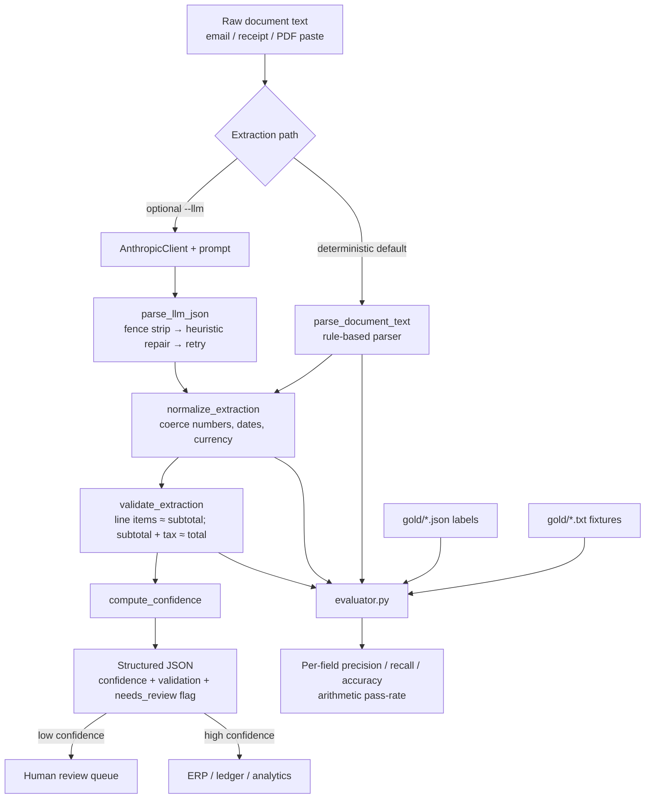

# Document Extraction Engine

**Turns messy invoice and receipt text into validated structured JSON — 27 tests;
field-level precision/recall/accuracy measured on an 8-document labelled gold set
with arithmetic validation.** Every extraction carries a confidence score and
routes low-confidence results to human review — so a wrong number gets a person,
not a silent write to your ledger.

Those numbers come from a real, offline evaluation harness — not a hand-wave.
Run `python3 evaluator.py` and reproduce them yourself in under a second, with no
API key and no network. The harness scores the **actual deterministic parsing,
number-coercion, and totals-reconciliation logic** against ground-truth JSON.

It turns messy invoice, receipt, and order-email text into clean, validated
structured JSON, with arithmetic reconciliation so bad extractions are caught
before they reach your database.

---

## Architecture



---

## Measured results

```
$ python3 evaluator.py

Gold documents evaluated: 8

field                    prec    rec    acc     f1
--------------------------------------------------
vendor                   1.00   1.00   1.00   1.00
date                     1.00   1.00   1.00   1.00
currency                 1.00   1.00   1.00   1.00
subtotal                 1.00   1.00   1.00   1.00
tax                      1.00   1.00   1.00   1.00
total                    1.00   1.00   1.00   1.00
line_item.description    1.00   1.00   1.00   1.00
line_item.qty            1.00   1.00   1.00   1.00
line_item.unit_price     1.00   1.00   1.00   1.00
line_item.amount         1.00   1.00   1.00   1.00
--------------------------------------------------
OVERALL                  1.00   1.00   1.00   1.00

Field-level accuracy: 100.0%
Arithmetic-validation pass-rate: 87.5% (7/8 docs reconcile)
```

**How to read this honestly:** the gold set is 8 diverse fixtures (US/EU/UK
currencies, slash/ISO/month-name dates, thousands separators, a no-tax services
invoice, a single-line receipt, and one document with a deliberately
non-reconciling total). 100% field accuracy means the deterministic parser
matches every labelled field on these 8 documents — it is a real, reproducible
measurement on a curated 8-document set, not a claim about every invoice in the
wild. The 87.5% pass-rate is the point: one document's totals don't add up, the
reconciliation check catches it, and that document is flagged `needs_review`.
Grow the gold set and the metrics stay honest — that is the whole point of the
harness.

---

## What it does

Given raw document text (forwarded emails, scanned receipts, vendor PDFs pasted
into Slack), the engine:

1. **Parses deterministically** — a rule-based parser extracts `vendor`, `date`,
   `currency`, `line_items[]`, `subtotal`, `tax`, `total` directly from the text.
   No network required. This is the path the gold-set metrics measure.
2. **Normalizes types** — coerces string numbers (`"$1,234.56"`, `"3"`) to
   floats/ints; normalizes dates to ISO `YYYY-MM-DD`; maps currency
   symbols/codes; fills missing fields with `null`.
3. **Validates arithmetic** — checks that line items sum to the subtotal and that
   `subtotal + tax ≈ total` (within one cent).
4. **Scores confidence and routes review** — a completeness + reconciliation
   score; anything below the review threshold is flagged `needs_review: true`.

An **optional** LLM path (`--llm`, Claude `claude-opus-4-8`) handles documents the
deterministic parser can't, with a JSON-repair ladder (fence stripping →
heuristic repair → one model-assisted repair) for malformed model output.

**Business value:** clean, reconciled structured data from messy invoices and
receipts — ready for accounting systems, ERP imports, or analytics — with a
built-in confidence gate so only the uncertain cases need a human.

---

## How to run

```bash
# No dependencies needed — standard library only.

# Deterministic extraction (offline):
python3 extractor.py sample_invoice.txt

# Reproduce the evaluation metrics:
python3 evaluator.py

# Run the test suite (offline — no API key, no network):
python3 -m pytest -q
```

Optional LLM path:

```bash
pip install anthropic                     # only for --llm
export ANTHROPIC_API_KEY="..."            # never printed or logged
python3 extractor.py --llm sample_invoice.txt
```

---

## How accuracy is measured (no tautologies)

The test suite and evaluator exercise the **real logic**, never a stub echoing
its own constant:

- `evaluator.py` runs `parse_document_text → normalize → validate` over every
  fixture in `gold/` and compares against ground-truth JSON, computing per-field
  precision / recall / accuracy / F1 and the arithmetic pass-rate.
- The gold set lives in `gold/<name>.txt` (input) + `gold/<name>.json` (labels).
  Add a pair and the metrics update automatically.
- LLM-specific behavior (the JSON-repair ladder, transport-vs-parse error
  handling) is tested with lightweight test-double clients that live **in the test
  file**, not in the production module.

---

## Engineering details

- **Typed errors.** `TransportError` (backend unreachable), `ParseError`
  (unparseable output), and `DataValidationError` are distinct — callers can
  retry transport failures while routing parse failures to review.
- **No swallowed exceptions.** Failures are logged with their class via the
  `doc_extractor` logger (set `DOC_EXTRACTOR_LOG_LEVEL=INFO`) and degrade to a
  low-confidence, `needs_review` result — they are not silently turned into
  `null` output.
- **Secrets.** The API key is read from `ANTHROPIC_API_KEY` only, referenced by
  name, and never printed or logged.
- **Stdlib only.** `extractor.py`, `evaluator.py`, and the tests import nothing
  outside the Python standard library; `anthropic` is lazy-imported and optional.

---

## Project layout

```
ai-doc-extractor/
├── extractor.py            # deterministic parser + LLM path + validation + CLI
├── evaluator.py            # offline eval harness (precision/recall/accuracy)
├── gold/                   # labelled gold set: 8 *.txt inputs + *.json labels
├── sample_invoice.txt      # demo input for the CLI
├── output/sample_output.json  # committed CLI output for sample_invoice.txt
├── test_extractor.py       # offline pytest suite (test doubles live here)
├── requirements.txt        # pytest only; anthropic optional
├── pyproject.toml          # package metadata + ruff config
├── .github/workflows/ci.yml
└── README.md
```

---

Built by [clira](https://clira.dev) — production-quality AI delivery, measured.
